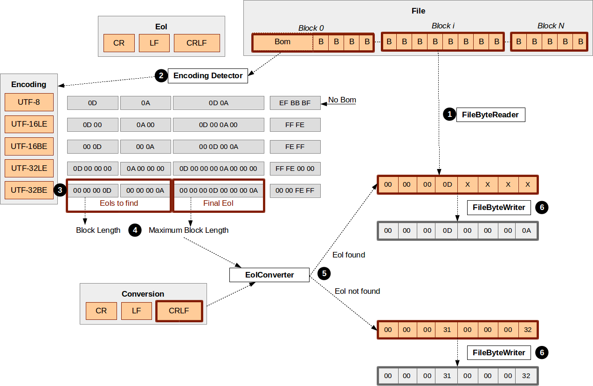

# eol-converter

The aim of this project consists in unifying the end of line characters of a set of files. It can deal with the end of lines used in the most typical operating systems: *LF, CR and CRLF*. The supported encodings of the files are: *UTF-8, UTF-16LE, UTF-16BE, UTF-32LE and UTF32-BE*.

## Table of content

- [Installation](#installation)
- [Scenario](#scenario)
- [Statistics](#statistics)
- [Unit Testing](#unit-testing)
- [Test Coverage](#test-coverage)

## 1) Installation

### JDK
The converter is developed in Java. The source code requires the Java Development Kit (JDK) version 8 or higher to be compiled and tested. The JDK can be downloaded [here](http://www.oracle.com/technetwork/java/javase/downloads).

### Gradle
The build tool used to compile, execute the tests and generate the coverage reports is Gradle. Gradle can be downloaded from [here](https://services.gradle.org/distributions/gradle-4.2-bin.zip).

Once Gradle is installed (and the path environment variable is properly set), the converter is built executing the following command in the directory where the eol-converter is downloaded:

    gradle build

## Scenario

The following image provides a high level description about how the converter actually works.

The converter includes the definition of the different end of lines encoded in every UTF format supported. For instance, in UTF-32BE the encoding is as follows:

> CR: `[00 00 00 0D]`   
> LF:  `[00 00 00 0A]`   
> CRLF: `[00 00 00 0D 00 00 00 0A]`   

Whenever a new conversion is started, the final end of line is provided, but the concrete bytes to replace cannot be determined until the actual file encoding is defined.

A file reader is in charge of reading the byte stream coming from the input file to be converted. This stream is divided into blocks of bytes in order to proceed with the conversion.

The first block usually contains a Byte Order Mark (BOM) that is used to determine the encoding used in the file by a encoding detector. In case the BOM is missing, the converter assumes a UTF-8 codification.

Inferring the codification of a file without a BOM requires moving from a deterministic approach to a probabilistic one. In that case, the encoding detector may detect two possible encodings (for instance: 60% of match with UTF-8 and 40% of match with UTF-16LE). With the aim of eliminating uncertainty the converter requires a BOM.

With the first block of the file, the encoding is detected and the concrete end of line bytes defined. On the one hand, the final end of line is defined, on the other the end of lines to find and replace are grouped. In addition, the maximum length of any of the end of lines considered is calculated, as well as the normal one. The maximum length is use to create the buffer in which the blocks are read, the normal length is used to move forward in the byte stream that comes from the file.

From this point the logic of the converter is simple:
 1. Read a new block.
 2. If the block starts with any of the end of lines to replace then write the final end of line to the converted file.
 3. Else, write the block as is.

## Statistics

 - 19 classes / 18 test classes
 - 117 tests
 - 100% code coverage, 89% branches coverage
 - 1372 lines of code

## Unit Testing

## Test Coverage

